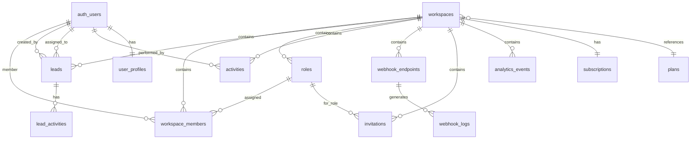
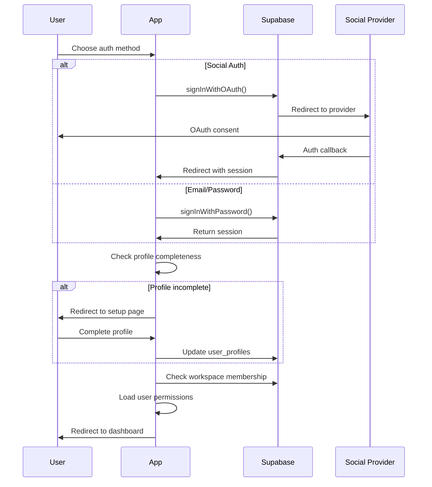

# Shivay CRM - Next.js CRM System

A modern, full-featured Customer Relationship Management (CRM) system built with Next.js, TypeScript, MongoDB, and Redux Toolkit Query.

## 🚀 Features

- **Lead Management**: Complete lead lifecycle management with status tracking
- **Workspace Management**: Multi-tenant workspace system with role-based access
- **Role & Permission System**: Granular permission control with custom roles
- **Subscription Management**: Integrated billing with Dodo Payments
- **Webhook System**: Real-time lead capture from external sources
- **Activity Tracking**: Comprehensive audit trail and activity logging
- **Lead Sources**: Customizable lead source management
- **Analytics Dashboard**: Workspace metrics and reporting

## 🛠️ Tech Stack

- **Frontend**: Next.js 14, TypeScript, Tailwind CSS, shadcn/ui
- **Backend**: MongoDB with Mongoose ODM
- **State Management**: Redux Toolkit Query (RTK Query)
- **Authentication**: JWT-based custom authentication
- **Payments**: Dodo Payments integration
- **Deployment**: Static export ready

## 📋 Prerequisites

- Node.js 18+
- npm/yarn/pnpm
- MongoDB (local installation or MongoDB Atlas)
- Dodo Payments account (for billing)

## 🚀 Quick Start

### 1. Clone & Install

```bash
git clone <repository-url>
cd shivay-crm
npm install
```

### 2. Environment Setup

Create `.env.local`:

```env
MONGODB_URI=mongodb://your-connection-string
JWT_SECRET=your-super-secret-jwt-key
JWT_EXPIRES_IN=7d
DODO_API_KEY=your_dodo_api_key
DODO_WEBHOOK_SECRET=your_dodo_webhook_secret
```

### 3. Database Setup

Seed MongoDB with initial data:

```bash
# Seed database with admin user and default data
npm run db:seed
```

This creates:

- Admin user: `admin@crm.com` / `admin123`
- Default plans (Free, Starter, Professional, Enterprise)
- Admin workspace with full permissions
- Default roles (Owner, Admin, Manager, Sales Rep)

### 4. Development

```bash
npm run dev
```

Visit `http://localhost:3000`

## 📁 Project Structure

```
├── app/                    # Next.js App Router
│   ├── api/               # API routes
│   │   ├── webhooks/      # Webhook endpoints
│   │   ├── roles/         # Role management
│   │   └── permissions/   # Permission system
│   ├── dashboard/         # Dashboard pages
│   ├── leads/            # Lead management
│   ├── roles/            # Role management UI
│   ├── workspace/        # Workspace settings
│   └── plans/            # Subscription plans
├── components/            # React components
│   ├── ui/               # shadcn/ui components
│   ├── layout/           # Layout components
│   └── providers/        # Context providers
├── lib/                  # Utilities & configurations
│   ├── api/              # API layer (RTK Query)
│   ├── supabase/         # Supabase client
│   └── utils/            # Helper functions
├── supabase/             # Database migrations
│   └── migrations/       # SQL migration files
└── types/                # TypeScript definitions
```

## 🔧 Development Guide

### Core Modules

#### 1. Workspace Management (`/workspace`)

**Database Tables:**

- `workspaces` - Main workspace data
- `workspace_members` - User-workspace relationships
- `subscriptions` - Billing subscriptions

**Key Files:**

- `lib/api/supabaseApi.ts` - API endpoints
- `app/workspace/` - UI components
- `supabase/migrations/20250801064727_cool_palace.sql` - Schema

**Development:**

```typescript
// Add new workspace endpoint
export const supabaseApi = createApi({
  endpoints: builder => ({
    createWorkspace: builder.mutation<Workspace, CreateWorkspaceRequest>({
      queryFn: async data => {
        // Implementation
      },
      invalidatesTags: ['Workspace'],
    }),
  }),
})
```

#### 2. Lead Management (`/leads`)

**Database Tables:**

- `leads` - Lead data
- `lead_activities` - Activity tracking
- `lead_sources` - Source management

**Key Files:**

- `lib/api/supabaseApi.ts` - Lead CRUD operations
- `app/leads/` - Lead management UI
- `supabase/migrations/20250801064758_lingering_unit.sql` - Schema

**API Endpoints:**

```typescript
// Available hooks
useGetLeadsQuery({ workspaceId, status })
useCreateLeadMutation()
useUpdateLeadMutation()
useDeleteLeadMutation()
```

**Adding New Lead Fields:**

1. Update `Lead` interface in `lib/api/supabaseApi.ts`
2. Add database column via migration
3. Update forms and validation

#### 3. Role & Permission System (`/roles`)

**Database Tables:**

- `roles` - Role definitions
- `permissions` - Available permissions
- `role_permissions` - Role-permission mapping

**Key Files:**

- `app/api/roles/route.ts` - Role API
- `app/api/permissions/route.ts` - Permission API
- `supabase/migrations/20250801064742_quiet_sunset.sql` - Schema

**Permission Format:**

```typescript
interface Permission {
  id: string
  name: string
  resource: string // 'leads', 'users', 'workspace', etc.
  action: 'create' | 'read' | 'update' | 'delete'
}
```

**Adding New Permissions:**

1. Add to permissions migration
2. Update RLS policies
3. Add UI controls

#### 4. Subscription & Billing (`/plans`)

**Database Tables:**

- `plans` - Available plans
- `subscriptions` - User subscriptions

**Key Files:**

- `supabase/migrations/20250801064821_floating_dream.sql` - Schema
- Integration with Dodo Payments

**Plan Structure:**

```typescript
interface Plan {
  id: string
  name: string
  price: number
  interval: 'month' | 'year'
  features: string[]
  limits: {
    leads: number
    users: number
    workspaces: number
  }
}
```

#### 5. Webhook System (`/api/webhooks`)

**Database Collections:**

- `webhooks` - Webhook configurations and statistics
- `webhook_logs` - Request/response logs (auto-deleted after 90 days)

**Key Files:**

- `app/api/webhooks/route.ts` - Webhook CRUD operations
- `app/api/webhooks/[id]/route.ts` - Individual webhook management
- `app/api/webhooks/receive/[id]/route.ts` - Webhook data receiver
- `components/webhooks/` - Webhook management UI
- `lib/api/webhookApi.ts` - Webhook API client

**Supported Webhook Types:**

- Facebook Lead Ads
- Google Forms
- Zapier (5000+ app integrations)
- Mailchimp
- HubSpot
- Salesforce
- Custom webhooks

**Webhook Usage:**

```bash
# Create webhook
curl -X POST https://your-domain.com/api/webhooks \
  -H "Content-Type: application/json" \
  -H "Authorization: Bearer token" \
  -d '{
    "workspaceId": "workspace_id",
    "name": "Facebook Lead Ads",
    "webhookType": "facebook_leads",
    "events": ["lead.created"]
  }'

# Receive lead data
curl -X POST https://your-domain.com/api/webhooks/receive/webhook_id \
  -H "Content-Type: application/json" \
  -d '{
    "name": "John Doe",
    "email": "john@example.com",
    "source": "facebook_leads"
  }'
```

#### 6. User Preferences System (`/api/users/preferences`)

**Key Files:**

- `app/api/users/preferences/route.ts` - User preferences API
- `lib/api/userPreferencesApi.ts` - Preferences API client
- `components/theme/ThemeCustomizer.tsx` - Theme customization UI

**Features:**

- Theme preferences (mode, colors, typography, animations)
- Notification settings
- Timezone and language preferences
- Auto-save functionality
- Persistent storage in user profile

**Usage:**

```bash
# Get user preferences
curl -X GET https://your-domain.com/api/users/preferences \
  -H "Authorization: Bearer token"

# Update theme preferences
curl -X PATCH https://your-domain.com/api/users/preferences \
  -H "Content-Type: application/json" \
  -H "Authorization: Bearer token" \
  -d '{
    "theme": {
      "mode": "dark",
      "primaryColor": "#3b82f6"
    }
  }'
```

### API Layer (RTK Query)

**File:** `lib/api/supabaseApi.ts`

**Adding New Endpoints:**

```typescript
export const supabaseApi = createApi({
  endpoints: builder => ({
    newEndpoint: builder.query<ReturnType, ParamsType>({
      queryFn: async params => {
        const { data, error } = await supabase
          .from('table_name')
          .select('*')
          .eq('field', params.value)

        if (error) return { error: error.message }
        return { data }
      },
      providesTags: ['TagName'],
    }),
  }),
})
```

## 🗄️ Database Schema

### Complete Database Structure

The CRM system uses a comprehensive PostgreSQL schema with proper foreign key relationships and constraints:

#### Core Tables

**1. Workspaces (`workspaces`)**

```sql
CREATE TABLE workspaces (
  id uuid PRIMARY KEY DEFAULT gen_random_uuid(),
  name text NOT NULL,
  slug text UNIQUE NOT NULL,
  plan_id text REFERENCES plans(id) ON DELETE SET NULL,
  subscription_status text DEFAULT 'active',
  dodo_customer_id text,
  dodo_subscription_id text,
  created_at timestamptz DEFAULT now(),
  updated_at timestamptz DEFAULT now()
);
```

**2. Users & Profiles (`user_profiles`)**

```sql
CREATE TABLE user_profiles (
  id uuid PRIMARY KEY REFERENCES auth.users(id) ON DELETE CASCADE,
  full_name text,
  avatar_url text,
  timezone text DEFAULT 'UTC',
  preferences jsonb DEFAULT '{}',
  created_at timestamptz DEFAULT now(),
  updated_at timestamptz DEFAULT now()
);
```

**3. Workspace Members (`workspace_members`)**

```sql
CREATE TABLE workspace_members (
  id uuid PRIMARY KEY DEFAULT gen_random_uuid(),
  workspace_id uuid REFERENCES workspaces(id) ON DELETE CASCADE NOT NULL,
  user_id uuid REFERENCES auth.users(id) ON DELETE CASCADE NOT NULL,
  role_id uuid REFERENCES roles(id) ON DELETE SET NULL NOT NULL,
  status text DEFAULT 'pending' CHECK (status IN ('pending', 'active', 'inactive', 'suspended')),
  invited_by uuid REFERENCES auth.users(id),
  invited_at timestamptz DEFAULT now(),
  joined_at timestamptz,
  created_at timestamptz DEFAULT now(),
  updated_at timestamptz DEFAULT now(),
  UNIQUE(workspace_id, user_id)
);
```

**4. Roles & Permissions (`roles`, `permissions`)**

```sql
CREATE TABLE roles (
  id uuid PRIMARY KEY DEFAULT gen_random_uuid(),
  name text NOT NULL,
  description text,
  workspace_id uuid REFERENCES workspaces(id) ON DELETE CASCADE,
  is_system boolean DEFAULT false,
  permissions jsonb DEFAULT '[]',
  created_at timestamptz DEFAULT now(),
  updated_at timestamptz DEFAULT now(),
  UNIQUE(name, workspace_id)
);

CREATE TABLE permissions (
  id uuid PRIMARY KEY DEFAULT gen_random_uuid(),
  name text NOT NULL,
  resource text NOT NULL,
  action text NOT NULL CHECK (action IN ('create', 'read', 'update', 'delete')),
  description text,
  created_at timestamptz DEFAULT now()
);
```

**5. Leads Management (`leads`, `lead_activities`)**

```sql
CREATE TABLE leads (
  id uuid PRIMARY KEY DEFAULT gen_random_uuid(),
  workspace_id uuid REFERENCES workspaces(id) ON DELETE CASCADE NOT NULL,
  name text NOT NULL,
  email text,
  phone text,
  company text,
  status text DEFAULT 'new' CHECK (status IN ('new', 'contacted', 'qualified', 'proposal', 'negotiation', 'closed_won', 'closed_lost')),
  source text DEFAULT 'manual',
  value numeric(10,2) DEFAULT 0,
  assigned_to uuid REFERENCES auth.users(id),
  tags text[] DEFAULT '{}',
  notes text,
  custom_fields jsonb DEFAULT '{}',
  created_by uuid REFERENCES auth.users(id) DEFAULT auth.uid(),
  created_at timestamptz DEFAULT now(),
  updated_at timestamptz DEFAULT now()
);

CREATE TABLE lead_activities (
  id uuid PRIMARY KEY DEFAULT gen_random_uuid(),
  lead_id uuid REFERENCES leads(id) ON DELETE CASCADE NOT NULL,
  user_id uuid REFERENCES auth.users(id) NOT NULL,
  activity_type text NOT NULL CHECK (activity_type IN ('created', 'updated', 'status_changed', 'assigned', 'note_added', 'email_sent', 'call_made', 'meeting_scheduled')),
  description text NOT NULL,
  metadata jsonb DEFAULT '{}',
  created_at timestamptz DEFAULT now()
);
```

**6. Plans & Subscriptions (`plans`, `subscriptions`)**

```sql
CREATE TABLE plans (
  id text PRIMARY KEY,
  name text NOT NULL,
  description text,
  price numeric(10,2) NOT NULL DEFAULT 0,
  interval text NOT NULL CHECK (interval IN ('month', 'year')) DEFAULT 'month',
  features jsonb DEFAULT '[]',
  limits jsonb DEFAULT '{}',
  is_active boolean DEFAULT true,
  sort_order integer DEFAULT 0,
  created_at timestamptz DEFAULT now(),
  updated_at timestamptz DEFAULT now()
);

CREATE TABLE subscriptions (
  id uuid PRIMARY KEY DEFAULT gen_random_uuid(),
  workspace_id uuid REFERENCES workspaces(id) ON DELETE CASCADE NOT NULL UNIQUE,
  plan_id text REFERENCES plans(id) NOT NULL,
  dodo_subscription_id text UNIQUE,
  dodo_customer_id text,
  status text DEFAULT 'active' CHECK (status IN ('active', 'canceled', 'past_due', 'unpaid', 'trialing')),
  current_period_start timestamptz,
  current_period_end timestamptz,
  trial_end timestamptz,
  canceled_at timestamptz,
  created_at timestamptz DEFAULT now(),
  updated_at timestamptz DEFAULT now()
);
```

### Database Migrations

**Location:** `supabase/migrations/`

**Migration Files:**

- `20250801064727_cool_palace.sql` - Initial workspace & member tables
- `20250801064742_quiet_sunset.sql` - Roles & permissions system
- `20250801064758_lingering_unit.sql` - Leads management
- `20250801064821_floating_dream.sql` - Plans & subscriptions
- `20250801064838_long_coral.sql` - User profiles & invitations
- `20250801064856_tender_forest.sql` - Activity tracking
- `20250801064928_red_frost.sql` - Webhook system
- `20250801064953_super_night.sql` - Analytics & reporting
- `20250801065022_hidden_flame.sql` - Data validation & constraints
- `20250802000000_database_integrity_fixes.sql` - **NEW: Foreign key fixes**

**Creating New Migration:**

```bash
supabase migration new feature_name
```

**Running Migrations:**

```bash
# Apply all pending migrations
supabase db push

# Reset database and apply all migrations
supabase db reset

# Check migration status
supabase migration list
```

**7. Invitations (`invitations`)**

```sql
CREATE TABLE invitations (
  id uuid PRIMARY KEY DEFAULT gen_random_uuid(),
  workspace_id uuid REFERENCES workspaces(id) ON DELETE CASCADE NOT NULL,
  email text NOT NULL,
  role_id uuid REFERENCES roles(id) NOT NULL,
  invited_by uuid REFERENCES auth.users(id) NOT NULL,
  token text UNIQUE NOT NULL DEFAULT encode(gen_random_bytes(32), 'hex'),
  status text DEFAULT 'pending' CHECK (status IN ('pending', 'accepted', 'expired', 'revoked')),
  expires_at timestamptz DEFAULT (now() + interval '7 days'),
  accepted_at timestamptz,
  created_at timestamptz DEFAULT now(),
  UNIQUE(workspace_id, email)
);
```

**8. Activity Tracking (`activities`)**

```sql
CREATE TABLE activities (
  id uuid PRIMARY KEY DEFAULT gen_random_uuid(),
  workspace_id uuid REFERENCES workspaces(id) ON DELETE CASCADE NOT NULL,
  user_id uuid REFERENCES auth.users(id) ON DELETE SET NULL,
  entity_type text NOT NULL CHECK (entity_type IN ('lead', 'user', 'workspace', 'role', 'invitation', 'subscription')),
  entity_id uuid,
  action text NOT NULL,
  description text NOT NULL,
  metadata jsonb DEFAULT '{}',
  created_at timestamptz DEFAULT now()
);
```

**9. Webhooks (`webhook_endpoints`, `webhook_logs`)**

```sql
CREATE TABLE webhook_endpoints (
  id uuid PRIMARY KEY DEFAULT gen_random_uuid(),
  workspace_id uuid REFERENCES workspaces(id) ON DELETE CASCADE NOT NULL,
  name text NOT NULL,
  url text UNIQUE NOT NULL,
  secret text NOT NULL DEFAULT encode(gen_random_bytes(32), 'hex'),
  is_active boolean DEFAULT true,
  events text[] DEFAULT '{"lead.created", "lead.updated"}',
  created_by uuid REFERENCES auth.users(id) DEFAULT auth.uid(),
  created_at timestamptz DEFAULT now(),
  updated_at timestamptz DEFAULT now()
);

CREATE TABLE webhook_logs (
  id uuid PRIMARY KEY DEFAULT gen_random_uuid(),
  webhook_endpoint_id uuid REFERENCES webhook_endpoints(id) ON DELETE CASCADE,
  request_id text,
  event_type text,
  payload jsonb DEFAULT '{}',
  response_status integer,
  response_body text,
  error_message text,
  processed_at timestamptz DEFAULT now(),
  created_at timestamptz DEFAULT now()
);
```

**10. Analytics (`analytics_events`)**

```sql
CREATE TABLE analytics_events (
  id uuid PRIMARY KEY DEFAULT gen_random_uuid(),
  workspace_id uuid REFERENCES workspaces(id) ON DELETE CASCADE NOT NULL,
  user_id uuid REFERENCES auth.users(id) ON DELETE SET NULL,
  event_name text NOT NULL,
  properties jsonb DEFAULT '{}',
  created_at timestamptz DEFAULT now()
);
```

### Database Relationships



### Database Integrity Features

**Foreign Key Constraints:**

- All relationships properly enforced with CASCADE/SET NULL behaviors
- Orphaned record prevention
- Referential integrity maintained

**Indexes for Performance:**

- All foreign key columns indexed
- Composite indexes for common query patterns
- Optimized for workspace-based queries

**Data Validation:**

- Email format validation
- Phone number format validation
- URL validation for webhooks
- Status enum constraints
- Plan limit enforcement

**Integrity Functions:**

```sql
-- Check database integrity
SELECT * FROM check_database_integrity();

-- Fix orphaned records
SELECT fix_orphaned_records();

-- Validate all foreign keys
SELECT validate_foreign_keys();
```

### UI Components

**Using shadcn/ui:**

```bash
npx shadcn-ui@latest add button
npx shadcn-ui@latest add form
npx shadcn-ui@latest add table
```

**Component Structure:**

```typescript
// components/feature/FeatureComponent.tsx
import { Button } from '@/components/ui/button';
import { useGetDataQuery } from '@/lib/api/supabaseApi';

export function FeatureComponent() {
  const { data, isLoading } = useGetDataQuery();

  return (
    <div>
      {/* Component JSX */}
    </div>
  );
}
```

## 🔐 Authentication & Security

### Authentication Methods

The CRM supports multiple authentication methods through Supabase Auth:

**1. Email/Password Authentication**

- Traditional email and password signup/signin
- Email verification required
- Password reset functionality

**2. Social Authentication**

- **Google OAuth** - Sign in with Google account
- **Facebook OAuth** - Sign in with Facebook account
- **GitHub OAuth** - Sign in with GitHub account

**3. Invitation-based Authentication**

- Users can be invited to workspaces via email
- Social auth users automatically accept pending invitations
- Role-based access from invitation

### Authentication Flow



### User Profile Management

**Profile Creation Flow:**

1. User authenticates via any method
2. `user_profiles` record created automatically via database trigger
3. Social auth users get pre-filled data from provider
4. Users complete missing profile information

**Profile Structure:**

```typescript
interface UserProfile {
  id: string // References auth.users.id
  full_name: string // User's display name
  avatar_url?: string // Profile picture URL
  timezone: string // User's timezone (default: UTC)
  preferences: object // User preferences (theme, notifications, etc.)
}
```

### Workspace Invitation System

**Invitation Flow:**

1. Workspace admin sends invitation with email and role
2. Invitation email sent with secure token
3. User clicks invitation link
4. If not authenticated, user signs up/in
5. System automatically accepts invitation and assigns role
6. User gains access to workspace with specified permissions

**Invitation Handling for Social Auth:**

- Pending invitations checked during profile setup
- Multiple invitations automatically accepted
- User notified of workspace access granted

### Row Level Security (RLS)

All tables use RLS policies for workspace isolation:

```sql
-- Example workspace isolation policy
CREATE POLICY "workspace_isolation" ON table_name
  FOR ALL TO authenticated
  USING (
    workspace_id IN (
      SELECT workspace_id FROM workspace_members
      WHERE user_id = auth.uid() AND status = 'active'
    )
  );

-- Role-based permission policy
CREATE POLICY "role_based_access" ON leads
  FOR UPDATE TO authenticated
  USING (
    workspace_id IN (
      SELECT wm.workspace_id
      FROM workspace_members wm
      JOIN roles r ON wm.role_id = r.id
      WHERE wm.user_id = auth.uid()
      AND wm.status = 'active'
      AND (r.permissions ? 'leads:update' OR r.permissions ? '*:*')
    )
  );
```

### Permission System

**Granular Permission Structure:**

```typescript
interface Permission {
  resource: string // 'leads', 'users', 'workspace', etc.
  action: string // 'create', 'read', 'update', 'delete'
  context?: string // 'own', 'assigned', 'all'
}

// Permission format: "resource:action" or "*:*" for admin
// Examples: "leads:create", "users:read", "workspace:update"
```

**Permission Checking:**

```typescript
// Check permissions in components
const hasPermission = (resource: string, action: string) => {
  const userPermissions = useAppSelector(state => state.auth.user?.permissions)
  return (
    userPermissions?.includes(`${resource}:${action}`) ||
    userPermissions?.includes('*:*')
  )
}

// Usage in components
if (hasPermission('leads', 'create')) {
  // Show create lead button
}
```

**Built-in Roles:**

- **Owner** - Full access (`*:*`)
- **Admin** - Most permissions except workspace deletion
- **Manager** - Lead and user management
- **Sales** - Lead access and basic user info
- **Viewer** - Read-only access

### Social Authentication Setup

**Quick Setup:**

1. Configure providers in Supabase Dashboard
2. Add redirect URLs for each provider
3. Set up OAuth applications with each provider
4. Test authentication flow

**Detailed Setup Guide:** See [Social Auth Setup Guide](docs/SOCIAL_AUTH_SETUP.md)

### Activity Management System

**Activity Types Tracked:**

- **Lead Activities** - Creation, updates, status changes, assignments
- **User Activities** - Login, profile updates, role changes
- **Workspace Activities** - Member additions, plan changes, settings updates
- **System Activities** - Automated actions, webhook triggers

**Activity Flow:**

1. User performs action
2. Permission check (role-based)
3. Plan limit check (subscription-based)
4. Action execution
5. Activity logging
6. Analytics update
7. Webhook triggers
8. Notifications sent

**Real-time Features:**

- Live activity feeds
- Real-time notifications
- Dashboard metric updates
- Webhook integrations

### Plan Management & Limits

**Plan Enforcement Points:**

- **Lead Count** - Maximum leads per workspace
- **User Count** - Maximum team members
- **Feature Access** - Advanced features by plan
- **API Calls** - Rate limiting by plan
- **Storage** - File upload limits
- **Integrations** - Webhook and API access

**Plan Upgrade Flow:**

1. User hits plan limit
2. System shows upgrade prompt
3. Redirect to billing/upgrade page
4. Plan change triggers limit updates
5. New features become available

### Integration Capabilities

**Webhook System:**

- Configurable webhook endpoints
- Event-based triggers
- Secure payload delivery
- Retry mechanisms
- Comprehensive logging

**API Access:**

- RESTful API endpoints
- Role-based API access
- Rate limiting by plan
- Comprehensive documentation

**External Integrations:**

- Email service integration
- Payment processing (Dodo)
- Social media platforms
- Third-party CRM systems

## 📊 Analytics & Metrics

**Database View:** `workspace_metrics`

**Available Metrics:**

- Total users/leads
- Revenue tracking
- Activity analytics
- Conversion rates

## 🚀 Deployment

### Static Export (Current Config)

```bash
npm run build
```

Outputs to `/out` directory for static hosting.

### Vercel Deployment

1. Connect GitHub repository
2. Set environment variables
3. Deploy automatically

### Custom Server

Update `next.config.js`:

```javascript
const nextConfig = {
  output: 'standalone', // Remove 'export'
  // other config
}
```

## 🧪 Testing

```bash
# Run tests (setup required)
npm test

# Type checking
npm run type-check

# Linting
npm run lint
```

## 📝 API Documentation

### Lead Endpoints

- `GET /api/leads` - List leads
- `POST /api/leads` - Create lead
- `PUT /api/leads/:id` - Update lead
- `DELETE /api/leads/:id` - Delete lead

### Webhook Endpoints

- `POST /api/webhooks/leads` - Create lead from webhook
- `GET /api/webhooks/leads` - Webhook documentation

## 🔧 Configuration

### Environment Variables

```env
# Supabase
NEXT_PUBLIC_SUPABASE_URL=
NEXT_PUBLIC_SUPABASE_ANON_KEY=
SUPABASE_SERVICE_ROLE_KEY=

# Dodo Payments
DODO_API_KEY=
DODO_WEBHOOK_SECRET=

# App
NEXT_PUBLIC_APP_URL=https://your-domain.com
```

### Tailwind Configuration

**File:** `tailwind.config.ts`

- Custom colors and themes
- Component styling
- Responsive breakpoints

## 🤝 Contributing

1. Fork repository
2. Create feature branch
3. Make changes
4. Add tests
5. Submit pull request

## 📄 License

[Your License Here]

## 🆘 Support

- Documentation: [Link to docs]
- Issues: [GitHub Issues]
- Email: [Support email]

---

**Happy Coding! 🚀**

# crm
# CRM-SASS
