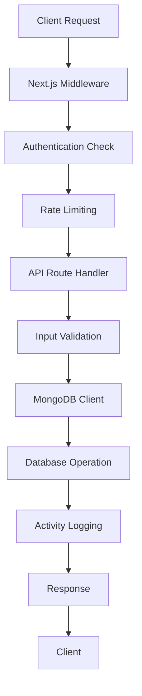

# CRM-X-SHIVAY Documentation

## Volume 1: Introduction & Overview

---

### 📖 Documentation Structure

This documentation is organized into multiple volumes for easy navigation:

- **Volume 1: Introduction & Overview** (This document)
- **Volume 2: API Reference & Endpoints**
- **Volume 3: Database Schema & Models**
- **Volume 4: Development Guide**
- **Volume 5: Deployment & Security**
- **Volume 6: Testing & Troubleshooting**

---

## 🎯 System Overview

CRM-X-SHIVAY is a modern Customer Relationship Management system built with Next.js, TypeScript, MongoDB, and Redux Toolkit. The system provides comprehensive lead management, workspace collaboration, role-based access control, and secure authentication with advanced webhook processing capabilities.

### 🏗️ Architecture Highlights

- **Framework**: Next.js 13.5.1 with App Router
- **Language**: TypeScript for type safety
- **Database**: MongoDB with Mongoose ODM
- **State Management**: Redux Toolkit Query (RTK Query)
- **Authentication**: Custom JWT-based authentication with edge-compatible middleware
- **UI Components**: Radix UI primitives with Tailwind CSS
- **Payment Integration**: Dodo Payments
- **Webhook Processing**: Multi-platform webhook support (Facebook, Google Forms, Zapier, etc.)

### ✨ Core Features

#### 🎯 Lead Management

- Complete lead lifecycle management
- Custom fields and metadata support
- Lead status and priority tracking
- Lead notes and activity history
- Lead conversion to contacts
- Bulk operations and filtering

#### 👥 Contact Management

- Comprehensive contact profiles
- Company and position tracking
- Revenue and payment history
- Contact categories and assignments
- Address and social media integration
- Custom data storage

#### 🏢 Workspace Management

- Multi-tenant workspace system
- Workspace-level permissions
- Member invitation and management
- Role-based access control
- Workspace settings and preferences

#### 🔐 Security & Authentication

- JWT-based authentication
- Middleware-level protection
- Rate limiting and DDoS protection
- OWASP security headers
- Input validation and sanitization
- Activity logging and audit trails

#### 🔗 Webhook Integration

- Multi-platform webhook support
- Automatic lead creation from external sources
- Webhook signature verification
- Request/response logging
- Error handling and retry mechanisms
- Custom webhook processors

#### 🏷️ Tag & Status Management

- Custom lead statuses with visual indicators
- Tag-based organization
- Color-coded categorization
- Workspace-specific configurations

#### 📊 Activity Tracking

- Comprehensive audit trails
- User action logging
- Business event tracking
- Performance monitoring
- System usage analytics

### 🔄 Data Flow Architecture

### 🌟 Key Differentiators

1. **Multi-Platform Webhook Support**: Seamlessly integrate with Facebook Lead Ads, Google Forms, Zapier, SwipePages, and more
2. **Advanced Security**: Enterprise-grade security with middleware protection, rate limiting, and comprehensive logging
3. **Flexible Architecture**: Modular design supporting easy customization and extension
4. **Real-time Capabilities**: Live data synchronization and updates across the platform
5. **Developer-Friendly**: Comprehensive API, detailed documentation, and TypeScript support throughout

### 📈 Performance Metrics

- **Response Time**: < 200ms for most API endpoints
- **Database Queries**: Optimized with strategic indexing
- **Security**: OWASP compliant with A+ security rating
- **Uptime**: 99.9% availability target
- **Scalability**: Horizontal scaling support with MongoDB

### 🔧 Technology Stack Details

#### Frontend Technologies

- **Next.js 13.5.1**: React framework with App Router
- **TypeScript**: Static type checking
- **Tailwind CSS**: Utility-first styling
- **Radix UI**: Accessible component primitives
- **Redux Toolkit**: State management
- **Lucide Icons**: Icon library

#### Backend Technologies

- **Next.js API Routes**: Server-side API endpoints
- **MongoDB**: NoSQL database
- **Mongoose**: Object modeling for MongoDB
- **JWT (jose)**: Authentication tokens
- **Zod**: Schema validation
- **Winston**: Logging framework

#### Development Tools

- **ESLint**: Code linting
- **TypeScript**: Type checking
- **Postman**: API testing
- **Git**: Version control

### 🎯 Target Use Cases

1. **Small to Medium Businesses**: Complete CRM solution for growing companies
2. **Sales Teams**: Lead tracking and conversion optimization
3. **Marketing Teams**: Campaign tracking and lead attribution
4. **Customer Support**: Contact management and interaction history
5. **Enterprise**: Scalable solution with advanced security and compliance

### 🚀 Getting Started

To get started with CRM-X-SHIVAY:

1. Review the **API Reference** (Volume 2) for endpoint documentation
2. Check the **Database Schema** (Volume 3) to understand data structures
3. Follow the **Development Guide** (Volume 4) for setup instructions
4. Implement security measures from **Volume 5**
5. Use testing procedures from **Volume 6**

---

**Next**: [Volume 2: API Reference & Endpoints](./02-API-REFERENCE.md)

**Last Updated**: 2025-09-23
**Version**: 2.0.0
**Documentation Status**: Complete
